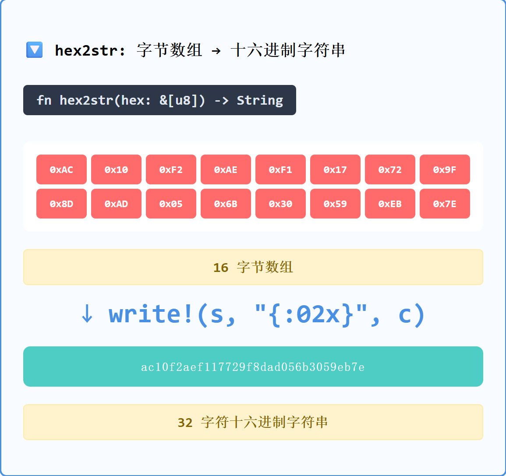
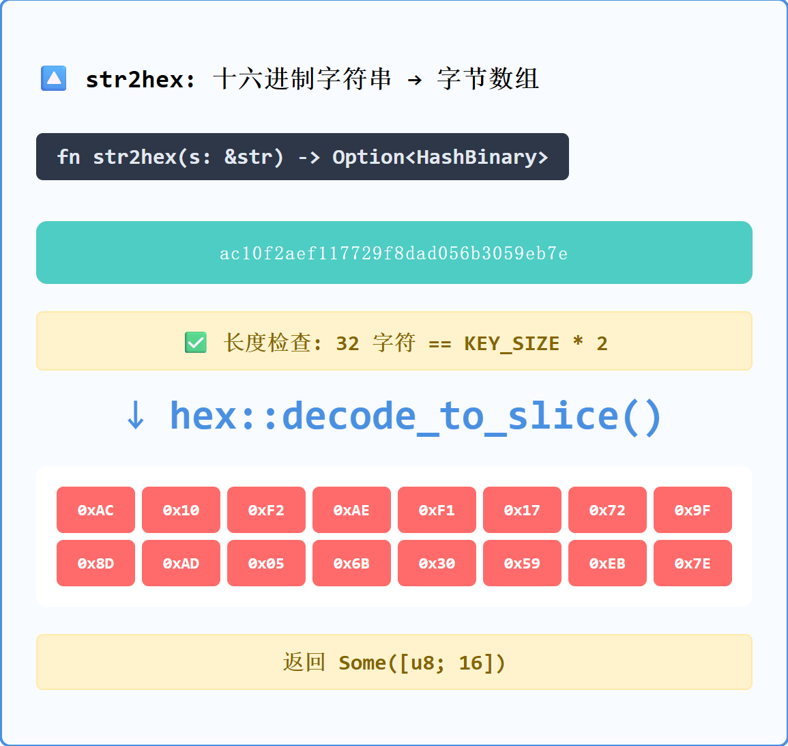
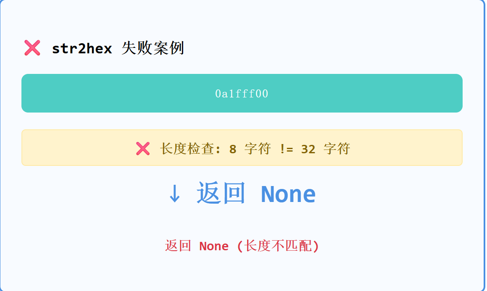
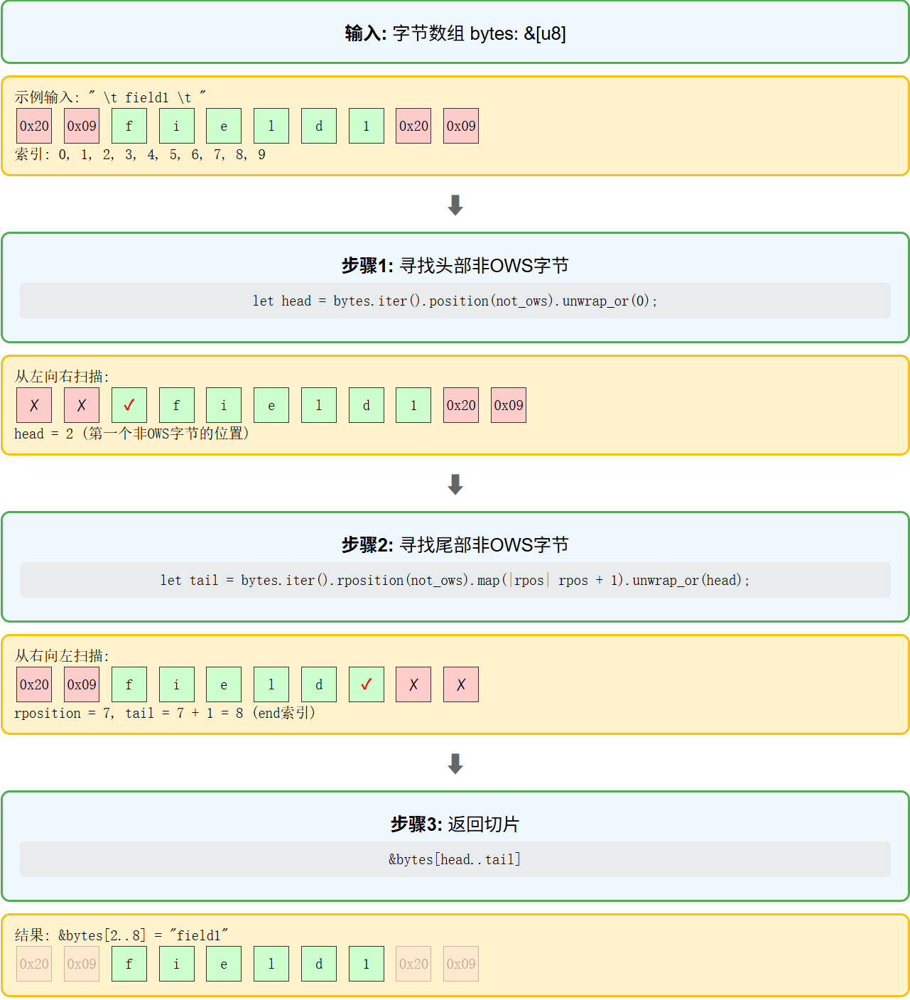

# Pingora Cache 学习笔记(1)

## 基础设计

### 128位哈希
```rust
const KEY_SIZE: usize = 16;  // 128位
pub type HashBinary = [u8; KEY_SIZE];
```
128位提供2^128种可能值，碰撞(两个不同的输入产生相同的哈希输出)概率极低。比64位更安全，比256位更省内存。在当前的计算能力下，它被认为是安全的，可以抵御暴力碰撞攻击。

### [u8; 16]而非u128
选择字节数组而非u128：
- Blake2b直接输出字节流，避免类型转换
- 无字节序问题，跨平台一致
- 序列化直接按字节顺序读写

这里感觉可以详细解释下：

小端序：最低有效字节 (LSB) 存储在最低的内存地址中。大多数现代 CPU（例如 Intel/AMD x86）都采用小端序。

大端字节序：最高有效字节 (MSB) 存储在最低内存地址。网络协议通常使用大端字节序（网络字节序）。

u128 的问题：如果在小端字节序系统上将 [u8; 16] 哈希转换为 u128，然后尝试在大端字节序系统上读取该 u128（反之亦然），除非明确处理字节交换，否则解释的值将会不同。这会导致代码不可移植并可能存在错误。

[u8; 16] 的解决方式：把哈希保存为 [u8; 16] 数组，这样始终处理的都是哈希函数生成的原始字节序列。这些字节的顺序本质上是哈希输出的一部分，并且无论底层系统的字节序如何，它都是一致的。这样就避免了字节交换的问题，从而使哈希表示具有普遍一致性。

## 十六进制转换

### 转换原理
- 1字节 = 8位
- 1个十六进制字符 = 4位  
- 8位 ÷ 4位 = 2个十六进制字符
- 16字节 × 2字符/字节 = 32字符

### 实现
```rust
fn hex2str(hex: &[u8]) -> String {
    let mut s = String::with_capacity(KEY_SIZE * 2);  // 预分配32字符
    for c in hex {
        write!(s, "{:02x}", c).unwrap();  // 每字节转2位十六进制
    }
    s
}
```


```rust
pub fn str2hex(s: &str) -> Option<HashBinary> {
    if s.len() != KEY_SIZE * 2 {  // 严格检查32字符
        return None;
    }
    let mut output = [0; KEY_SIZE];
    hex::decode_to_slice(s.as_bytes(), &mut output).ok()?;
    Some(output)
}
```


这里会有个严格的字符检查，比如下面这个就会直接 return None:



## Blake2b哈希

### 算法选择
```rust
pub(crate) type Blake2b128 = Blake2b<blake2::digest::consts::U16>;
```
- 比MD5更快更安全
- 跨机器输出一致
- 128位平衡性能和安全

### 压缩函数
任意长度输入产生128位输出：
- 输入分成固定块处理
- 每块通过压缩函数更新内部状态
- 最终输出固定长度结果

### combined_bin实现
```rust
fn combined_bin(&self) -> HashBinary {
    let key = self.primary_bin();
    if let Some(v) = self.variance_bin() {
        let mut hasher = Blake2b128::new();
        hasher.update(key);      // 追加主键到缓冲区
        hasher.update(v);        // 追加变体到缓冲区
        hasher.finalize().into() // 计算组合哈希
    } else {
        key
    }
}
```
hasher是累积状态机，不改变key和v的值。

## 内存优化

### 数据结构对比

**CacheKey（工作格式）**：
```rust
pub struct CacheKey {
    namespace: String,                      // 24字节
    primary: String,                        // 24字节
    primary_bin_override: Option<HashBinary>, // 24字节
    variance: Option<HashBinary>,           // 24字节
    pub user_tag: String,                   // 24字节
    pub extensions: Extensions,             // 16字节
}
// 总计：136字节
```

**CompactCacheKey（存储格式）**：
```rust
pub struct CompactCacheKey {
    pub primary: HashBinary,                // 16字节
    pub variance: Option<Box<HashBinary>>,  // 8-16字节
    pub user_tag: Box<str>,                 // 16字节
}
// 总计：40-48字节
```
节省约65%内存。

### Option<Box<HashBinary>>优化

**Option<HashBinary>内存布局**：
```
None时: 24字节（判别符 + 预留的HashBinary空间）
Some时: 24字节（判别符 + 16字节数据）
```

**Option<Box<HashBinary>>内存布局**：
```
None时: 8字节（只有null指针）
Some时: 16字节（8字节指针 + 16字节堆数据）
```
大多数缓存无变体，Option<Box<T>>在None时节省16字节。

### Box<str> vs String

**String结构**：
```rust
struct String {
    ptr: *mut u8,      // 8字节指针
    len: usize,        // 8字节长度
    capacity: usize,   // 8字节容量
}
// 栈上：24字节，堆上：capacity字节
```

**Box<str>结构**：
```rust
// Box<str>是胖指针，包含数据指针和长度
struct BoxStr {
    ptr: *const u8,    // 8字节数据指针
    len: usize,        // 8字节长度
}
// 栈上：16字节，堆上：len字节（无额外容量）
```
Box<str>节省8字节栈空间，堆分配精确匹配字符串长度。

### 延迟哈希计算
```rust
fn primary_bin(&self) -> HashBinary {
    if let Some(primary_bin_override) = self.primary_bin_override {
        primary_bin_override  // 直接返回，避免重复计算
    } else {
        self.primary_hasher().finalize().into()  // 按需计算
    }
}
```

## 设计模式

### Trait抽象
```rust
pub trait CacheHashKey {
    fn primary_bin(&self) -> HashBinary;          // 基础哈希
    fn variance_bin(&self) -> Option<HashBinary>; // 变体哈希
    fn combined_bin(&self) -> HashBinary;         // 最终存储键
    fn user_tag(&self) -> &str;                   // 用户标识
}
```

### 类型转换
```rust
pub fn to_compact(&self) -> CompactCacheKey {
    CompactCacheKey {
        primary: self.primary_bin(),
        variance: self.variance_bin().map(Box::new),
        user_tag: self.user_tag.clone().into_boxed_str(),
    }
}
```
实现工作格式到存储格式的转换。

### 变体支持
支持HTTP Vary头语义：
- 同一URL根据不同请求头产生多个缓存版本
- variance_bin()提供变体标识
- combined_bin()生成区分存储键

## 应用场景

1. **基础缓存**：namespace + URI → primary_bin
2. **多租户**：user_tag区分不同用户配额
3. **变体缓存**：Accept-Encoding等产生不同variance
4. **自定义键**：primary_bin_override直接指定哈希


## 版本兼容性设计

### 问题背景
缓存数据可能在磁盘存储数月，软件升级时不能丢失已有缓存数据。分布式系统中不同节点可能运行不同版本。

### 版本演进
```rust
// V0: 基础版本，无版本标识
struct InternalMetaV0 {
    fresh_until: SystemTime,
    created: SystemTime,
    stale_while_revalidate_sec: u32,
    stale_if_error_sec: u32,
}

// V1: 添加版本管理
struct InternalMetaV1 {
    version: u8,  // 新增版本号
    // ... 其他字段相同
}

// V2: 功能扩展
struct InternalMetaV2 {
    version: u8,
    // ... 原有字段
    updated: SystemTime,           // 新增：更新时间
    variance: Option<HashBinary>,  // 新增：变体支持
}
```

### 智能反序列化
```rust
pub(crate) fn deserialize(buf: &[u8]) -> Result<InternalMetaLatest> {
    match rmp::decode::read_array_len(preread_buf) {
        4 => Ok(InternalMetaV0::deserialize(buf)?.into()), // V0通过字段数识别
        _ => {
            let version = rmp::decode::read_pfix(preread_buf)?;
            match version {
                1 => Ok(InternalMetaV1::deserialize(buf)?.into()),
                2 => InternalMetaV2::deserialize(buf),
            }
        }
    }
}
```

V0没有版本号，通过MessagePack数组长度(4个字段)识别。V1开始有明确版本标识。

### 数据迁移
```rust
impl From<InternalMetaV0> for InternalMetaV2 {
    fn from(v0: InternalMetaV0) -> Self {
        InternalMetaV2 {
            version: InternalMetaV2::VERSION,
            fresh_until: v0.fresh_until,
            created: v0.created,
            updated: v0.created,  // 旧数据updated=created
            variance: None,       // 新字段默认值
            ..Default::default()
        }
    }
}
```

### 渐进式字段添加
```rust
#[serde(default)]                              // 缺失时使用默认值
#[serde(skip_serializing_if = "Option::is_none")] // None时不序列化
pub(crate) variance: Option<HashBinary>,
```

这样设计确保：
- 老版本软件可以读取新版本数据（忽略不认识的字段）
- 新版本软件可以读取老版本数据（使用默认值填充）
- 零停机升级：缓存在版本升级过程中保持可用

## 静态延迟初始化设计

### 问题分析
HTTP头序列化需要压缩字典，但字典路径在运行时才确定，且需要全局共享。

普通`static`要求编译时常量，无法处理运行时IO操作。每次序列化都重新加载字典会造成性能问题。

### 解决方案
```rust
static HEADER_SERDE: Lazy<HeaderSerde> = Lazy::new(|| {
    let dict_path_opt = COMPRESSION_DICT_PATH.get();
    let result = dict_path_opt.and_then(load_file);
    HeaderSerde::new(result)  // 有字典时压缩，无字典时仍可工作
});
```

这个设计解决了好几几个问题：
- 延迟到首次使用时初始化，避免启动时IO开销
- 全局唯一实例，避免重复加载字典
- 线程安全的一次性初始化
- 字典加载失败时降级为无压缩模式

### 封装接口
```rust
pub(crate) fn header_serialize(header: &ResponseHeader) -> Result<Vec<u8>> {
    HEADER_SERDE.serialize(header)
}

pub(crate) fn header_deserialize<T: AsRef<[u8]>>(buf: T) -> Result<ResponseHeader> {
    HEADER_SERDE.deserialize(buf.as_ref())
}
```

这样设计隐藏了全局变量细节，外部调用者不需要知道内部使用了`Lazy`和字典加载逻辑。

# Cache-Control 解析算法学习笔记

## 静态延迟初始化优化

### 问题分析
正则表达式编译成本高，每次解析Cache-Control都重新编译会造成性能问题。

### 解决方案
```rust
static RE_CACHE_DIRECTIVE: Lazy<Regex> = Lazy::new(|| {
    Regex::new(r#"复杂正则表达式"#).unwrap()
});
```

优势：
- 全局唯一编译：避免重复编译开销
- 延迟初始化：首次使用时才编译，节省启动时间
- 线程安全：多线程并发访问无竞态

## 字节级处理算法

### 直接字节操作
```rust
for captures in RE_CACHE_DIRECTIVE.captures_iter(line.as_bytes()) {
    let value = DirectiveValue(cap.as_bytes().to_vec());
}
```

避免了不必要的UTF-8验证和转换，直接在字节层面处理HTTP头。

### 零拷贝引号去除
```rust
pub fn parse_as_bytes(&self) -> &[u8] {
    self.0.strip_prefix(b"\"")
        .and_then(|bytes| bytes.strip_suffix(b"\""))
        .unwrap_or(&self.0[..])
}
```

返回原始数据的切片，无内存分配。这个方法处理了quoted-string格式而不创建新字符串。

## OWS去除的双指针算法

### 算法实现
```rust
fn trim_ows(bytes: &[u8]) -> &[u8] {
    let head = bytes.iter().position(not_ows).unwrap_or(0);
    let tail = bytes.iter().rposition(not_ows)
        .map(|rpos| rpos + 1)
        .unwrap_or(head);
    &bytes[head..tail]
}
```

算法分析：
- 时间复杂度O(n)，最多扫描两遍
- 空间复杂度O(1)，只返回切片引用
- 边界处理：全空白或空数组返回空切片




边界情况处理:
1. 空数组: head=0, tail=0 → 返回空切片
2. 全是空白: 

- position()返回None, unwrap_or(0) → head=0

- rposition()返回None, unwrap_or(head) → tail=0 → 返回空切片

3. 无空白: head=0, tail=length → 返回原数组
应用场景是处理`private="field1, field2"`中逗号分隔的字段名。

## 正则表达式设计

### 字节级匹配
```rust
(?-u)  // 禁用Unicode，使用ASCII字节模式
```

这样设计是因为HTTP头是字节流，不保证UTF-8编码。直接在字节级操作避免编码转换开销。

### 宽松解析策略
- 允许分号和逗号作为分隔符
- 支持非ASCII字符
- 数值指令允许引号包围

比RFC更宽松，提高兼容性。

## 数据结构选择

### IndexMap vs HashMap
```rust
pub type DirectiveMap = IndexMap<DirectiveKey, Option<DirectiveValue>>;
```

选择IndexMap是因为：
- 保持HTTP头指令的插入顺序
- 提供O(1)查找性能
- 内存局部性好于HashMap+Vec的组合

内存局部性优势的体现：
```bash
// IndexMap: 数据连续存储
[key1, value1][key2, value2][key3, value3]  // 缓存友好

// HashMap+Vec: 间接访问
HashMap: {hash -> index} → Vec: [value1, value3, value2]  // 随机访问
```

IndexMap遍历时CPU缓存命中率更高，减少内存访问延迟。

### Option<DirectiveValue>设计
区分有值指令和无值指令：
- `Some(value)`: `max-age=300`
- `None`: `public`

这样可以正确处理`private`(应用整个响应)和`private="field"`(仅特定字段)的区别。

## 容错机制

### UTF-8转换失败处理
```rust
let key = captures.get(1).and_then(|cap| {
    str::from_utf8(cap.as_bytes()).ok().map(|token| token.to_lowercase())
});
if key.is_none() {
    continue;  // 跳过无效指令，继续解析
}
```

非UTF-8指令名直接跳过，避免整个解析失败。

### 数值溢出处理
```rust
match self.parse_as_str()?.parse::<u32>() {
    Ok(value) => Ok(value),
    Err(e) if e.kind() == &IntErrorKind::PosOverflow => {
        Ok(DELTA_SECONDS_OVERFLOW_VALUE)  // RFC规定的2^31上限
    }
}
```

按RFC 9111处理溢出，使用2^31作为"无限TTL"的近似值。

## 迭代器模式应用

### ListValueIter实现
```rust
pub struct ListValueIter<'a>(slice::Split<'a, u8, fn(&u8) -> bool>);

impl<'a> Iterator for ListValueIter<'a> {
    type Item = &'a [u8];
    fn next(&mut self) -> Option<Self::Item> {
        Some(trim_ows(self.0.next()?))
    }
}
```

每次迭代自动去除OWS空白。

这些算法设计在高并发HTTP代理场景下能有效减少内存分配和CPU开销。