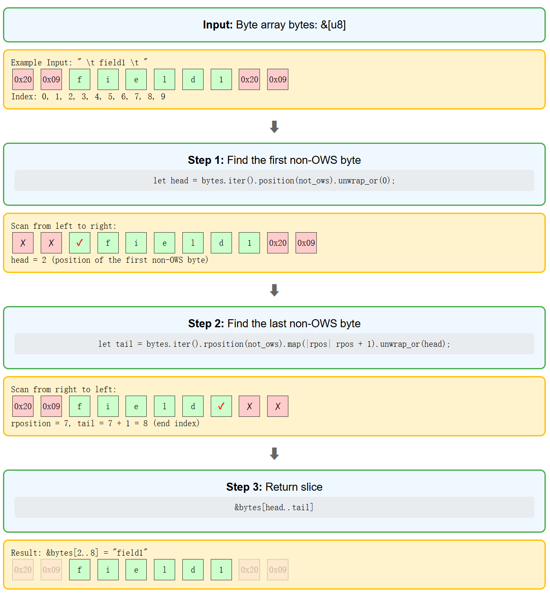

# Pingora Cache Study Notes (1)

## Basic Design

### 128-bit Hash
```rust
const KEY_SIZE: usize = 16;  // 128 bits
pub type HashBinary = [u8; KEY_SIZE];
```
128 bits provide 2^128 possible values with extremely low collision probability (two different inputs producing the same hash output). More secure than 64-bit, more memory-efficient than 256-bit. Considered secure against brute-force collision attacks with current computing power.

### [u8; 16] vs u128
Choosing byte array over u128:
- Blake2b directly outputs byte stream, avoiding type conversion
- No endianness issues, cross-platform consistency
- Serialization reads/writes directly in byte order

Detailed explanation:

Little-endian: Least significant byte (LSB) stored at lowest memory address. Most modern CPUs (e.g., Intel/AMD x86) use little-endian.

Big-endian: Most significant byte (MSB) stored at lowest memory address. Network protocols typically use big-endian (network byte order).

u128 problem: If you convert a [u8; 16] hash to u128 on a little-endian system, then try to read that u128 on a big-endian system (or vice versa), the interpreted value will be different unless byte swapping is explicitly handled. This leads to non-portable code and potential bugs.

[u8; 16] solution: By keeping hashes as [u8; 16] arrays, you're always working with the raw byte sequence generated by the hash function. The order of these bytes is inherently part of the hash output and is consistent regardless of the underlying system's endianness. This avoids byte swapping issues, making the hash representation universally consistent.

## Hexadecimal Conversion

### Conversion Principle
- 1 byte = 8 bits
- 1 hex character = 4 bits  
- 8 bits ÷ 4 bits = 2 hex characters
- 16 bytes × 2 chars/byte = 32 characters

### Implementation
```rust
fn hex2str(hex: &[u8]) -> String {
    let mut s = String::with_capacity(KEY_SIZE * 2);  // Pre-allocate 32 chars
    for c in hex {
        write!(s, "{:02x}", c).unwrap();  // Convert each byte to 2 hex chars
    }
    s
}
```

```rust
pub fn str2hex(s: &str) -> Option<HashBinary> {
    if s.len() != KEY_SIZE * 2 {  // Strict check for 32 characters
        return None;
    }
    let mut output = [0; KEY_SIZE];
    hex::decode_to_slice(s.as_bytes(), &mut output).ok()?;
    Some(output)
}
```

Strict character validation - invalid input returns None immediately.

## Blake2b Hash

### Algorithm Selection
```rust
pub(crate) type Blake2b128 = Blake2b<blake2::digest::consts::U16>;
```
- Faster and more secure than MD5
- Consistent output across machines
- 128-bit balances performance and security

### Compression Function
Arbitrary-length input produces 128-bit output:
- Input split into fixed blocks for processing
- Each block updates internal state through compression function
- Final output is fixed-length result

### combined_bin Implementation
```rust
fn combined_bin(&self) -> HashBinary {
    let key = self.primary_bin();
    if let Some(v) = self.variance_bin() {
        let mut hasher = Blake2b128::new();
        hasher.update(key);      // Append primary key to buffer
        hasher.update(v);        // Append variance to buffer
        hasher.finalize().into() // Compute combined hash
    } else {
        key
    }
}
```
Hasher is an accumulating state machine that doesn't modify key and v values.

## Memory Optimization

### Data Structure Comparison

**CacheKey (Working Format)**:
```rust
pub struct CacheKey {
    namespace: String,                      // 24 bytes
    primary: String,                        // 24 bytes
    primary_bin_override: Option<HashBinary>, // 24 bytes
    variance: Option<HashBinary>,           // 24 bytes
    pub user_tag: String,                   // 24 bytes
    pub extensions: Extensions,             // 16 bytes
}
// Total: 136 bytes
```

**CompactCacheKey (Storage Format)**:
```rust
pub struct CompactCacheKey {
    pub primary: HashBinary,                // 16 bytes
    pub variance: Option<Box<HashBinary>>,  // 8-16 bytes
    pub user_tag: Box<str>,                 // 16 bytes
}
// Total: 40-48 bytes
```
Saves approximately 65% memory.

### Option<Box<HashBinary>> Optimization

**Option<HashBinary> memory layout**:
```
None: 24 bytes (discriminant + reserved HashBinary space)
Some: 24 bytes (discriminant + 16 bytes data)
```

**Option<Box<HashBinary>> memory layout**:
```
None: 8 bytes (null pointer only)
Some: 16 bytes (8-byte pointer + 16 bytes heap data)
```
Most caches have no variance, so Option<Box<T>> saves 16 bytes for None cases.

### Box<str> vs String

**String structure**:
```rust
struct String {
    ptr: *mut u8,      // 8-byte pointer
    len: usize,        // 8-byte length
    capacity: usize,   // 8-byte capacity
}
// Stack: 24 bytes, heap: capacity bytes
```

**Box<str> structure**:
```rust
// Box<str> is a fat pointer containing data pointer and length
struct BoxStr {
    ptr: *const u8,    // 8-byte data pointer
    len: usize,        // 8-byte length
}
// Stack: 16 bytes, heap: len bytes (no extra capacity)
```
Box<str> saves 8 bytes stack space and heap allocation exactly matches string length.

### Lazy Hash Computation
```rust
fn primary_bin(&self) -> HashBinary {
    if let Some(primary_bin_override) = self.primary_bin_override {
        primary_bin_override  // Direct return, avoid recomputation
    } else {
        self.primary_hasher().finalize().into()  // Compute on demand
    }
}
```

## Design Patterns

### Trait Abstraction
```rust
pub trait CacheHashKey {
    fn primary_bin(&self) -> HashBinary;          // Base hash
    fn variance_bin(&self) -> Option<HashBinary>; // Variance hash
    fn combined_bin(&self) -> HashBinary;         // Final storage key
    fn user_tag(&self) -> &str;                   // User identifier
}
```

### Type Conversion
```rust
pub fn to_compact(&self) -> CompactCacheKey {
    CompactCacheKey {
        primary: self.primary_bin(),
        variance: self.variance_bin().map(Box::new),
        user_tag: self.user_tag.clone().into_boxed_str(),
    }
}
```
Implements conversion from working format to storage format.

### Variance Support
Supports HTTP Vary header semantics:
- Same URL generates multiple cache versions based on different request headers
- variance_bin() provides variance identifier
- combined_bin() generates distinguishing storage key

## Use Cases

1. **Basic caching**: namespace + URI → primary_bin
2. **Multi-tenancy**: user_tag differentiates quotas for different users
3. **Variance caching**: Accept-Encoding etc. generate different variance
4. **Custom keys**: primary_bin_override directly specifies hash

## Version Compatibility Design

### Problem Background
Cache data may persist on disk for months, software upgrades cannot lose existing cache data. Different nodes in distributed systems may run different versions.

### Version Evolution
```rust
// V0: Base version, no version identifier
struct InternalMetaV0 {
    fresh_until: SystemTime,
    created: SystemTime,
    stale_while_revalidate_sec: u32,
    stale_if_error_sec: u32,
}

// V1: Add version management
struct InternalMetaV1 {
    version: u8,  // New version number
    // ... other fields same
}

// V2: Feature expansion
struct InternalMetaV2 {
    version: u8,
    // ... original fields
    updated: SystemTime,           // New: update time
    variance: Option<HashBinary>,  // New: variance support
}
```

### Smart Deserialization
```rust
pub(crate) fn deserialize(buf: &[u8]) -> Result<InternalMetaLatest> {
    match rmp::decode::read_array_len(preread_buf) {
        4 => Ok(InternalMetaV0::deserialize(buf)?.into()), // V0 identified by field count
        _ => {
            let version = rmp::decode::read_pfix(preread_buf)?;
            match version {
                1 => Ok(InternalMetaV1::deserialize(buf)?.into()),
                2 => InternalMetaV2::deserialize(buf),
            }
        }
    }
}
```

V0 has no version number, identified by MessagePack array length (4 fields). V1+ have explicit version identifiers.

### Data Migration
```rust
impl From<InternalMetaV0> for InternalMetaV2 {
    fn from(v0: InternalMetaV0) -> Self {
        InternalMetaV2 {
            version: InternalMetaV2::VERSION,
            fresh_until: v0.fresh_until,
            created: v0.created,
            updated: v0.created,  // For old data updated=created
            variance: None,       // New field default value
            ..Default::default()
        }
    }
}
```

### Progressive Field Addition
```rust
#[serde(default)]                              // Use default when missing
#[serde(skip_serializing_if = "Option::is_none")] // Don't serialize None
pub(crate) variance: Option<HashBinary>,
```

This design ensures:
- Old software can read new version data (ignoring unknown fields)
- New software can read old version data (filling with defaults)
- Zero-downtime upgrades: cache remains available during version upgrades

## Static Lazy Initialization Design

### Problem Analysis
HTTP header serialization needs compression dictionary, but dictionary path is determined at runtime and needs global sharing.

Regular `static` requires compile-time constants, cannot handle runtime IO operations. Reloading dictionary for each serialization causes performance issues.

### Solution
```rust
static HEADER_SERDE: Lazy<HeaderSerde> = Lazy::new(|| {
    let dict_path_opt = COMPRESSION_DICT_PATH.get();
    let result = dict_path_opt.and_then(load_file);
    HeaderSerde::new(result)  // Compress when dictionary available, still works without
});
```

This design solves several issues:
- Lazy initialization on first use, avoiding startup IO overhead
- Global unique instance, avoiding repeated dictionary loading
- Thread-safe one-time initialization
- Graceful degradation to no-compression mode when dictionary loading fails

### Encapsulated Interface
```rust
pub(crate) fn header_serialize(header: &ResponseHeader) -> Result<Vec<u8>> {
    HEADER_SERDE.serialize(header)
}

pub(crate) fn header_deserialize<T: AsRef<[u8]>>(buf: T) -> Result<ResponseHeader> {
    HEADER_SERDE.deserialize(buf.as_ref())
}
```

This design hides global variable details - external callers don't need to know about internal `Lazy` usage and dictionary loading logic.

# Cache-Control Parsing Algorithm Study Notes

## Static Lazy Initialization Optimization

### Problem Analysis
Regex compilation is expensive, recompiling for each Cache-Control parse causes performance issues.

### Solution
```rust
static RE_CACHE_DIRECTIVE: Lazy<Regex> = Lazy::new(|| {
    Regex::new(r#"complex regex pattern"#).unwrap()
});
```

Advantages:
- Global unique compilation: avoids repeated compilation overhead
- Lazy initialization: compile only on first use, saves startup time
- Thread-safe: concurrent access without race conditions

## Byte-level Processing Algorithm

### Direct Byte Operations
```rust
for captures in RE_CACHE_DIRECTIVE.captures_iter(line.as_bytes()) {
    let value = DirectiveValue(cap.as_bytes().to_vec());
}
```

Avoids unnecessary UTF-8 validation and conversion, processing HTTP headers directly at byte level.

### Zero-copy Quote Removal
```rust
pub fn parse_as_bytes(&self) -> &[u8] {
    self.0.strip_prefix(b"\"")
        .and_then(|bytes| bytes.strip_suffix(b"\""))
        .unwrap_or(&self.0[..])
}
```

Returns slice of original data without memory allocation. This method handles quoted-string format without creating new strings.

## OWS Removal Two-pointer Algorithm

### Algorithm Implementation
```rust
fn trim_ows(bytes: &[u8]) -> &[u8] {
    let head = bytes.iter().position(not_ows).unwrap_or(0);
    let tail = bytes.iter().rposition(not_ows)
        .map(|rpos| rpos + 1)
        .unwrap_or(head);
    &bytes[head..tail]
}
```

Algorithm analysis:
- Time complexity O(n), at most two passes
- Space complexity O(1), only returns slice reference
- Edge case handling: all whitespace or empty array returns empty slice



Edge case handling:
1. Empty array: head=0, tail=0 → return empty slice
2. All whitespace: 
   - position() returns None, unwrap_or(0) → head=0
   - rposition() returns None, unwrap_or(head) → tail=0 → return empty slice
3. No whitespace: head=0, tail=length → return original array

Use case is processing field names separated by commas in `private="field1, field2"`.

## Regex Design

### Byte-level Matching
```rust
(?-u)  // Disable Unicode, use ASCII byte mode
```

This design is because HTTP headers are byte streams, not guaranteed to be UTF-8 encoded. Direct byte-level operations avoid encoding conversion overhead.

### Lenient Parsing Strategy
- Allow both semicolons and commas as separators
- Support non-ASCII characters
- Numeric directives allow quote wrapping

More lenient than RFC, improves compatibility.

## Data Structure Selection

### IndexMap vs HashMap
```rust
pub type DirectiveMap = IndexMap<DirectiveKey, Option<DirectiveValue>>;
```

IndexMap chosen because:
- Preserves insertion order of HTTP header directives
- Provides O(1) lookup performance
- Better memory locality than HashMap+Vec combination

Memory locality advantage:
```bash
// IndexMap: continuous data storage
[key1, value1][key2, value2][key3, value3]  // Cache-friendly

// HashMap+Vec: indirect access
HashMap: {hash -> index} → Vec: [value1, value3, value2]  // Random access
```

IndexMap has higher CPU cache hit rate during traversal, reducing memory access latency.

### Option<DirectiveValue> Design
Distinguishes valued and valueless directives:
- `Some(value)`: `max-age=300`
- `None`: `public`

This correctly handles the difference between `private` (applies to entire response) and `private="field"` (specific fields only).

## Error Recovery Mechanisms

### UTF-8 Conversion Failure Handling
```rust
let key = captures.get(1).and_then(|cap| {
    str::from_utf8(cap.as_bytes()).ok().map(|token| token.to_lowercase())
});
if key.is_none() {
    continue;  // Skip invalid directive, continue parsing
}
```

Non-UTF-8 directive names are skipped directly, avoiding total parsing failure.

### Numeric Overflow Handling
```rust
match self.parse_as_str()?.parse::<u32>() {
    Ok(value) => Ok(value),
    Err(e) if e.kind() == &IntErrorKind::PosOverflow => {
        Ok(DELTA_SECONDS_OVERFLOW_VALUE)  // RFC-specified 2^31 limit
    }
}
```

Handles overflow per RFC 9111, using 2^31 as approximation for "infinite TTL".

## Iterator Pattern Application

### ListValueIter Implementation
```rust
pub struct ListValueIter<'a>(slice::Split<'a, u8, fn(&u8) -> bool>);

impl<'a> Iterator for ListValueIter<'a> {
    type Item = &'a [u8];
    fn next(&mut self) -> Option<Self::Item> {
        Some(trim_ows(self.0.next()?))
    }
}
```

Automatically trims OWS whitespace on each iteration.

These algorithm designs effectively reduce memory allocation and CPU overhead in high-concurrency HTTP proxy scenarios.